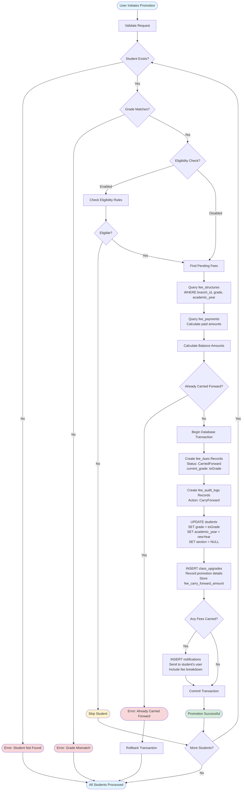
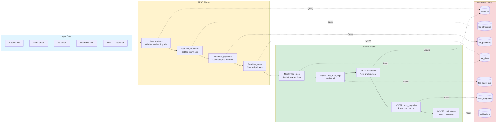
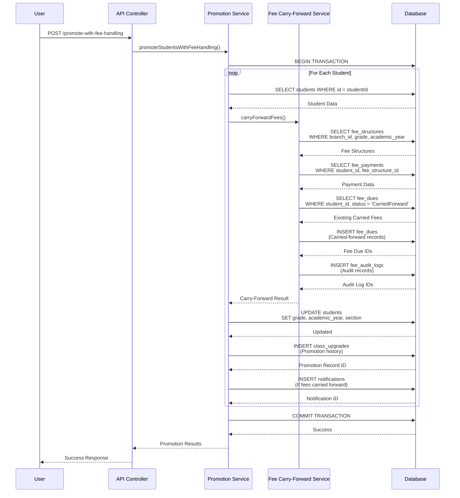
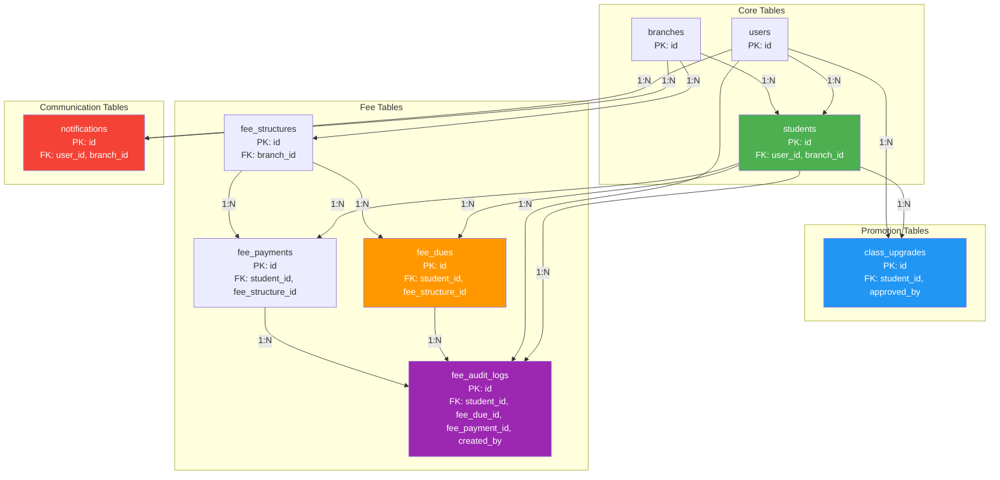
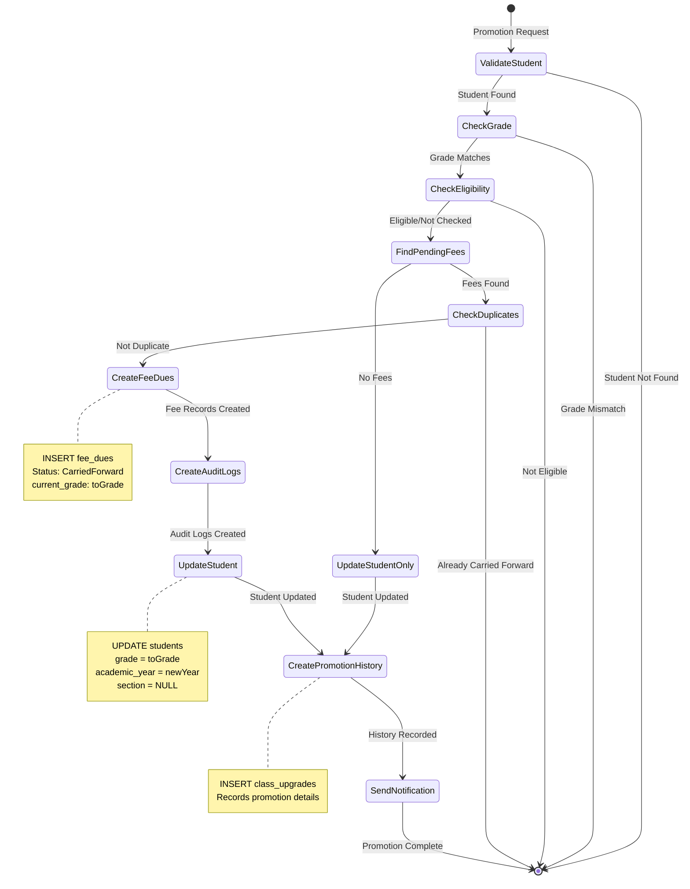
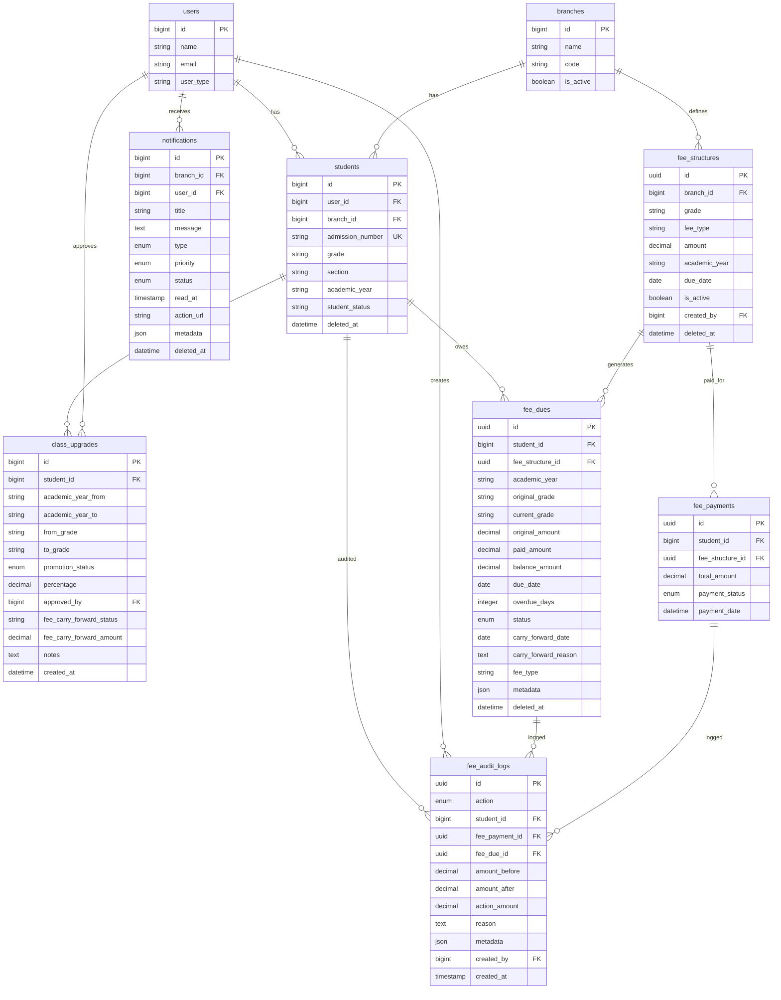

# Student Promotion - Database Table Relationships

## Overview

This document details all database tables and their relationships involved in the student promotion process.

## Student Promotion Flow Diagram

### Complete Promotion Process Flow



### Data Flow Through Tables



### Table Update Sequence



### Table Relationships Flow



### Promotion State Changes



## Entity Relationship Diagram



## Core Tables for Student Promotion

### 1. `students` Table

**Primary Key**: `id`  
**Purpose**: Stores student information including current grade and academic year

**Key Fields for Promotion**:

-   `id` (bigint, PK) - Student identifier
-   `user_id` (bigint, FK → `users.id`) - Links to user account
-   `branch_id` (bigint, FK → `branches.id`) - School branch
-   `grade` (string) - **UPDATED during promotion** (from_grade → to_grade)
-   `section` (string, nullable) - **RESET to NULL** during promotion
-   `academic_year` (string) - **UPDATED** to new academic year
-   `student_status` (enum) - Active/Inactive status

**Relationships**:

-   `belongsTo(User)` via `user_id`
-   `belongsTo(Branch)` via `branch_id`
-   `hasMany(ClassUpgrade)` - Promotion history
-   `hasMany(FeeDue)` - Fee dues records
-   `hasMany(FeeAuditLog)` - Audit trail

**Indexes**:

-   `user_id + branch_id`
-   `branch_id + grade + section + student_status`
-   `grade + section + student_status`

---

### 2. `class_upgrades` Table

**Primary Key**: `id`  
**Purpose**: Tracks promotion history for each student

**Key Fields**:

-   `id` (bigint, PK)
-   `student_id` (bigint, FK → `students.id`, CASCADE DELETE)
-   `academic_year_from` (string) - Original academic year
-   `academic_year_to` (string) - New academic year
-   `from_grade` (string) - Grade before promotion
-   `to_grade` (string) - Grade after promotion
-   `promotion_status` (enum: 'Promoted', 'Detained', 'Left', 'Graduated')
-   `percentage` (decimal 5,2, nullable) - Student percentage (if applicable)
-   `approved_by` (bigint, FK → `users.id`, SET NULL) - User who approved promotion
-   `fee_carry_forward_status` (string, nullable) - 'CarriedForward' or 'None'
-   `fee_carry_forward_amount` (decimal 10,2, nullable) - Total fees carried forward
-   `notes` (text, nullable) - Additional notes
-   `created_at` (timestamp) - Promotion date

**Relationships**:

-   `belongsTo(Student)` via `student_id`
-   `belongsTo(User, 'approved_by')` - Approving user

**Indexes**:

-   `student_id + academic_year_from` - For querying promotion history

**Data Flow During Promotion**:

1. New record created for each promotion
2. Stores promotion details (from/to grades, academic years)
3. Links to approving user
4. Records fee carry-forward information

---

### 3. `fee_dues` Table

**Primary Key**: `id` (UUID)  
**Purpose**: Tracks pending fees, including carried-forward fees from promotion

**Key Fields**:

-   `id` (uuid, PK)
-   `student_id` (bigint, FK → `students.id`, CASCADE DELETE)
-   `fee_structure_id` (uuid, FK → `fee_structures.id`, SET NULL) - Original fee structure
-   `academic_year` (string) - Academic year of original fee
-   `original_grade` (string) - Grade when fee was originally due
-   `current_grade` (string) - **UPDATED** to new grade after promotion
-   `original_amount` (decimal 10,2) - Original fee amount
-   `paid_amount` (decimal 10,2) - Amount already paid
-   `balance_amount` (decimal 10,2) - Remaining balance
-   `due_date` (date) - Original due date
-   `overdue_days` (integer) - Days overdue
-   `status` (enum: 'Pending', 'PartiallyPaid', 'Overdue', 'Waived', 'CarriedForward', 'Paid')
-   `carry_forward_date` (date, nullable) - **SET** when fee is carried forward
-   `carry_forward_reason` (text, nullable) - Reason for carry-forward
-   `fee_type` (string) - Fee category (Tuition, Transport, Exam, etc.)
-   `installment_number` (integer, nullable)
-   `metadata` (json, nullable) - Stores promotion details:
    ```json
    {
        "promoted_from_grade": "Grade 5",
        "promoted_to_grade": "Grade 6",
        "original_academic_year": "2024-2025"
    }
    ```

**Relationships**:

-   `belongsTo(Student)` via `student_id`
-   `belongsTo(FeeStructure)` via `fee_structure_id`

**Indexes**:

-   `student_id + academic_year + status` - For querying student dues
-   `due_date + status` - For overdue queries
-   `current_grade + status` - For grade-wise queries
-   `fee_type + status` - For fee type filtering

**Data Flow During Promotion**:

1. **Before Promotion**: Existing records with `status = 'Pending'` or `'PartiallyPaid'`
2. **During Promotion**: New records created with:
    - `status = 'CarriedForward'`
    - `current_grade` = new grade
    - `carry_forward_date` = current date
    - `carry_forward_reason` = "Carried forward from {fromGrade} to {toGrade}"
    - `metadata` = promotion details

---

### 4. `fee_structures` Table

**Primary Key**: `id` (UUID)  
**Purpose**: Defines fee structures for grades and academic years

**Key Fields**:

-   `id` (uuid, PK)
-   `branch_id` (bigint, FK → `branches.id`, CASCADE DELETE)
-   `grade` (string) - Grade level
-   `fee_type` (string) - Fee category
-   `amount` (decimal 10,2) - Fee amount
-   `academic_year` (string) - Academic year
-   `due_date` (date, nullable) - Due date
-   `is_active` (boolean) - Active status

**Relationships**:

-   `belongsTo(Branch)` via `branch_id`
-   `hasMany(FeeDue)` - Fee dues generated from this structure

**Usage in Promotion**:

-   Used to identify pending fees for a student's grade
-   Queried during fee carry-forward process
-   Filters: `branch_id`, `grade`, `academic_year`, `is_active = true`

---

### 5. `fee_audit_logs` Table

**Primary Key**: `id` (UUID)  
**Purpose**: Audit trail for all fee-related actions including carry-forward

**Key Fields**:

-   `id` (uuid, PK)
-   `action` (enum: 'Payment', 'Refund', 'Discount', 'CarryForward', 'Waiver', 'Adjustment')
-   `student_id` (bigint, FK → `students.id`, CASCADE DELETE)
-   `fee_payment_id` (uuid, FK → `fee_payments.id`, SET NULL, nullable)
-   `fee_due_id` (uuid, FK → `fee_dues.id`, SET NULL, nullable)
-   `amount_before` (decimal 10,2) - Amount before action
-   `amount_after` (decimal 10,2) - Amount after action
-   `action_amount` (decimal 10,2) - Amount of the action
-   `reason` (text, nullable) - Reason for action
-   `metadata` (json, nullable) - Additional context:
    ```json
    {
        "from_grade": "Grade 5",
        "to_grade": "Grade 6",
        "fee_type": "Tuition",
        "academic_year_from": "2024-2025",
        "academic_year_to": "2025-2026"
    }
    ```
-   `created_by` (bigint, FK → `users.id`, CASCADE DELETE) - User who performed action
-   `created_at` (timestamp) - Action timestamp (immutable)

**Relationships**:

-   `belongsTo(Student)` via `student_id`
-   `belongsTo(FeePayment)` via `fee_payment_id` (nullable)
-   `belongsTo(FeeDue)` via `fee_due_id` (nullable)
-   `belongsTo(User, 'created_by')` - User who performed action

**Indexes**:

-   `student_id + created_at` - Student audit history
-   `action + created_at` - Action type queries
-   `created_by` - User activity tracking

**Data Flow During Promotion**:

-   New record created for each fee carry-forward
-   `action = 'CarryForward'`
-   Links to `fee_due_id` of carried-forward fee
-   Stores promotion metadata

---

### 6. `notifications` Table

**Primary Key**: `id`  
**Purpose**: Stores notifications sent to users, including promotion notifications

**Key Fields**:

-   `id` (bigint, PK)
-   `branch_id` (bigint, FK → `branches.id`, CASCADE DELETE, nullable)
-   `user_id` (bigint, FK → `users.id`, CASCADE DELETE, nullable) - Recipient
-   `title` (string) - Notification title
-   `message` (text) - Notification message
-   `type` (enum: 'Info', 'Warning', 'Error', 'Success', 'Alert')
-   `priority` (enum: 'Low', 'Medium', 'High', 'Urgent')
-   `status` (enum: 'Pending', 'Sent', 'Read', 'Failed')
-   `read_at` (timestamp, nullable) - When notification was read
-   `action_url` (string, nullable) - URL for action (e.g., `/students/{id}/fees`)
-   `metadata` (json, nullable) - Additional data:
    ```json
    {
        "from_grade": "Grade 5",
        "to_grade": "Grade 6",
        "fees_carried_forward": 5000.0
    }
    ```
-   `sent_at` (timestamp, nullable) - When notification was sent
-   `created_by` (bigint, FK → `users.id`, SET NULL, nullable)
-   `deleted_at` (timestamp, nullable) - Soft delete

**Relationships**:

-   `belongsTo(Branch)` via `branch_id` (nullable)
-   `belongsTo(User)` via `user_id` - Notification recipient

**Indexes**:

-   `user_id + status` - Unread notifications
-   `branch_id + type` - Branch notifications
-   `read_at` - Read status queries

**Data Flow During Promotion**:

-   New notification created for student's parent/user
-   `title` = "Promotion to {toGrade}"
-   `message` = Promotion details + fee breakdown
-   `action_url` = `/students/{id}/fees`
-   `metadata` = Promotion and fee details

---

## Supporting Tables

### 7. `users` Table

**Purpose**: User accounts (students, parents, staff, admins)

**Key Fields for Promotion**:

-   `id` (bigint, PK)
-   `user_type` (enum) - Student, Parent, Teacher, Admin, etc.

**Relationships**:

-   `hasOne(Student)` - Student profile
-   `hasMany(ClassUpgrade, 'approved_by')` - Promotions approved
-   `hasMany(Notification)` - Notifications received
-   `hasMany(FeeAuditLog, 'created_by')` - Audit logs created

---

### 8. `branches` Table

**Purpose**: School branches/campuses

**Key Fields**:

-   `id` (bigint, PK)
-   `name` (string)
-   `code` (string)
-   `is_active` (boolean)

**Relationships**:

-   `hasMany(Student)` - Students in branch
-   `hasMany(FeeStructure)` - Fee structures for branch
-   `hasMany(Notification)` - Branch notifications

---

## Data Flow During Promotion

### Step-by-Step Table Changes

1. **Read Operations** (Before Promotion):

    - Query `students` to validate student exists and grade matches
    - Query `fee_structures` to find pending fees for student's grade
    - Query `fee_payments` to calculate paid amounts
    - Query `fee_dues` to check for existing carried-forward fees

2. **Write Operations** (During Promotion):

    - **UPDATE `students`**:

        ```sql
        UPDATE students SET
          grade = 'Grade 6',
          academic_year = '2025-2026',
          section = NULL,
          updated_at = NOW()
        WHERE id = {student_id}
        ```

    - **INSERT `class_upgrades`**:

        ```sql
        INSERT INTO class_upgrades (
          student_id, academic_year_from, academic_year_to,
          from_grade, to_grade, promotion_status,
          approved_by, fee_carry_forward_status, fee_carry_forward_amount
        ) VALUES (...)
        ```

    - **INSERT `fee_dues`** (for each pending fee):

        ```sql
        INSERT INTO fee_dues (
          student_id, fee_structure_id, academic_year,
          original_grade, current_grade, original_amount,
          paid_amount, balance_amount, due_date, overdue_days,
          status, carry_forward_date, carry_forward_reason,
          fee_type, metadata
        ) VALUES (...)
        ```

    - **INSERT `fee_audit_logs`** (for each fee carry-forward):

        ```sql
        INSERT INTO fee_audit_logs (
          action, student_id, fee_due_id,
          amount_before, amount_after, action_amount,
          reason, metadata, created_by
        ) VALUES ('CarryForward', ...)
        ```

    - **INSERT `notifications`** (if fees carried forward):
        ```sql
        INSERT INTO notifications (
          user_id, branch_id, title, message,
          type, priority, status, action_url, metadata
        ) VALUES (...)
        ```

## Key Relationships Summary

| Relationship                             | Type        | Description                                      |
| ---------------------------------------- | ----------- | ------------------------------------------------ |
| `students` → `class_upgrades`            | One-to-Many | Each student can have multiple promotion records |
| `students` → `fee_dues`                  | One-to-Many | Each student can have multiple fee due records   |
| `students` → `fee_audit_logs`            | One-to-Many | Each student can have multiple audit log entries |
| `class_upgrades` → `students`            | Many-to-One | Each promotion belongs to one student            |
| `class_upgrades` → `users` (approved_by) | Many-to-One | Each promotion approved by one user              |
| `fee_dues` → `students`                  | Many-to-One | Each fee due belongs to one student              |
| `fee_dues` → `fee_structures`            | Many-to-One | Each fee due references one fee structure        |
| `fee_audit_logs` → `students`            | Many-to-One | Each audit log belongs to one student            |
| `fee_audit_logs` → `fee_dues`            | Many-to-One | Each audit log can reference one fee due         |
| `notifications` → `users`                | Many-to-One | Each notification sent to one user               |
| `notifications` → `branches`             | Many-to-One | Each notification can belong to one branch       |

## Foreign Key Constraints

### Cascade Behaviors

| Table                        | Foreign Key         | On Delete | Description                            |
| ---------------------------- | ------------------- | --------- | -------------------------------------- |
| `students.user_id`           | `users.id`          | CASCADE   | Delete student if user deleted         |
| `students.branch_id`         | `branches.id`       | RESTRICT  | Prevent deletion if students exist     |
| `class_upgrades.student_id`  | `students.id`       | CASCADE   | Delete promotions if student deleted   |
| `class_upgrades.approved_by` | `users.id`          | SET NULL  | Keep promotion if approver deleted     |
| `fee_dues.student_id`        | `students.id`       | CASCADE   | Delete dues if student deleted         |
| `fee_dues.fee_structure_id`  | `fee_structures.id` | SET NULL  | Keep due if structure deleted          |
| `fee_audit_logs.student_id`  | `students.id`       | CASCADE   | Delete logs if student deleted         |
| `fee_audit_logs.fee_due_id`  | `fee_dues.id`       | SET NULL  | Keep log if due deleted                |
| `notifications.user_id`      | `users.id`          | CASCADE   | Delete notifications if user deleted   |
| `notifications.branch_id`    | `branches.id`       | CASCADE   | Delete notifications if branch deleted |

## Query Patterns for Promotion

### 1. Get Student Promotion History

```sql
SELECT * FROM class_upgrades
WHERE student_id = ?
ORDER BY created_at DESC
```

### 2. Get Pending Fees for Carry-Forward

```sql
SELECT fs.*,
       COALESCE(SUM(fp.total_amount), 0) as paid_amount,
       (fs.amount - COALESCE(SUM(fp.total_amount), 0)) as balance
FROM fee_structures fs
LEFT JOIN fee_payments fp ON fs.id = fp.fee_structure_id
  AND fp.student_id = ?
  AND fp.payment_status = 'Completed'
WHERE fs.branch_id = ?
  AND fs.grade = ?
  AND fs.academic_year = ?
  AND fs.is_active = true
GROUP BY fs.id
HAVING balance > 0
```

### 3. Get Carried-Forward Fees

```sql
SELECT * FROM fee_dues
WHERE student_id = ?
  AND status = 'CarriedForward'
  AND academic_year = ?
  AND original_grade = ?
ORDER BY carry_forward_date DESC
```

### 4. Get Promotion Summary

```sql
SELECT
  cu.*,
  s.admission_number,
  s.grade as current_grade,
  u.name as approved_by_name
FROM class_upgrades cu
JOIN students s ON cu.student_id = s.id
LEFT JOIN users u ON cu.approved_by = u.id
WHERE cu.from_grade = ?
  AND cu.to_grade = ?
  AND cu.academic_year_to = ?
```

## Indexes for Performance

### Critical Indexes for Promotion Queries

1. **`students` table**:

    - `(user_id, branch_id)` - User lookup
    - `(branch_id, grade, section, student_status)` - Grade filtering
    - `(grade, section, student_status)` - Grade queries

2. **`class_upgrades` table**:

    - `(student_id, academic_year_from)` - Student history
    - `(from_grade, to_grade, academic_year_to)` - Promotion reports

3. **`fee_dues` table**:

    - `(student_id, academic_year, status)` - Student dues
    - `(current_grade, status)` - Grade-wise dues
    - `(fee_type, status)` - Fee type filtering
    - `(due_date, status)` - Overdue queries

4. **`fee_audit_logs` table**:

    - `(student_id, created_at)` - Student audit trail
    - `(action, created_at)` - Action type queries

5. **`notifications` table**:
    - `(user_id, status)` - Unread notifications
    - `(branch_id, type)` - Branch notifications

## Notes

1. **Transaction Safety**: All promotion operations are wrapped in database transactions to ensure atomicity
2. **Soft Deletes**: `students`, `fee_dues`, `fee_structures`, and `notifications` use soft deletes
3. **UUID vs BigInt**: `fee_dues`, `fee_structures`, and `fee_audit_logs` use UUID primary keys
4. **Metadata Fields**: JSON fields store flexible additional data for future extensibility
5. **Audit Trail**: All fee carry-forward actions are logged in `fee_audit_logs` for compliance
